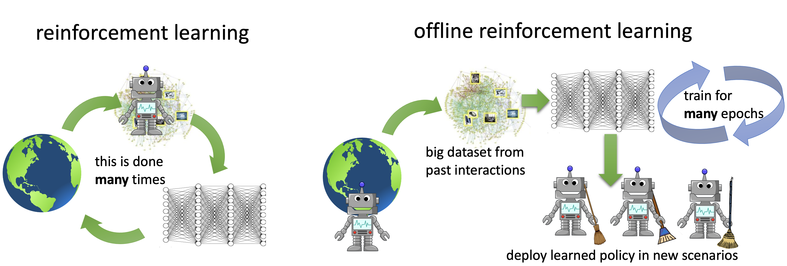
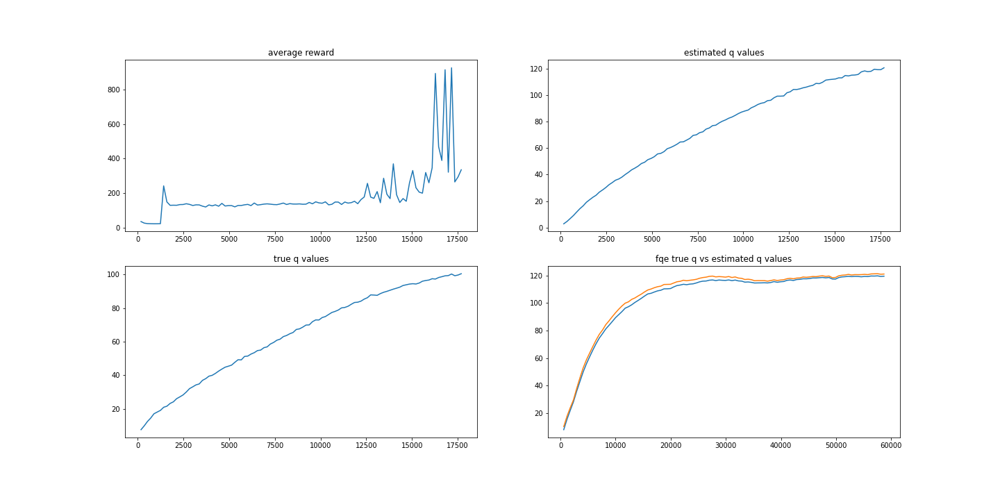

# Deep Reinforcement Learning
>#### _Shyamal H Anadkat | Fall '21_

# Background 
Hello! This is a repository for AIPI530 DeepRL final project. **The goal is to build a pipeline for offline RL**. The
starter code has been forked from [d3rlpy](https://github.com/takuseno/d3rlpy) (_see citation at the bottom_)
Offline reinforcement learning (RL) defines the task of learning from a fixed batch of data.

Before diving in, I would recommend getting familiarized with basic Reinforcement Learning. 
Here is a link to my blog post on Reinforcement Learning to get you started:
[RL Primer](https://shyamalanadkat.medium.com/reinforcement-learning-a-primer-29116d487e42)

The blog post briefly covers the following:

* What is reinforcement learning ? <br/>
* What are the pros and cons of reinforcement learning ? <br/>
* When should we consider applying reinforcement learning (and when should not) ? <br/>
* What's the difference between supervised learning and reinforcement learning ? <br/>
* What is offline reinforcement learning ? What are the pros and cons of offline reinforcement learning ? <br/>
* When should we consider applying offline reinforcement learning (and when should not) ? <br/>
* Have an example of offline reinforcement learning in the real-world <br/>

>
_source: https://bair.berkeley.edu/blog/2020/12/07/offline/_

# Getting Started

#### (_please read carefully_)

This project is customized to training CQL on a custom dataset in d3rlpy, and training OPE (FQE) to evaluate the trained
policy. Important scripts:

1. `cql_train.py`: at the root of the project is the main script, used to train cql & get evaluation scores
2. `plot_helper.py`: utility script to help produce the plots required

### How do I install & run this project ?

---

**1. Clone this repository**
```
git clone https://github.com/shyamal-anadkat/offlinerl
```

**2. Install **pybullet** from source:**
```
pip install git+https://github.com/takuseno/d4rl-pybullet
```

**3. Install requirements:** 
```
pip install Cython numpy 
pip install -e .
```

4. **Execute **`cql_train.py`** found at the root of the project**
    * Default dataset is `hopper-bullet-mixed-v0`
    * Default no. of `epochs` is `10`. You can change this via custom args `--epochs_cql` & `--epochs_fqe`
    * For example if we want to run for 10 epochs: 
```   
python cql_train.py --epochs_cql 10 --epochs_fqe 10
```
(see colab example below for more clarity)

5. **Important Logs:**
    * Estimated Q values vs training steps (CQL): `d3rlpy_logs/CQL_hopper-bullet-mixed-v0_1/init_value.csv`
    * Average reward vs training steps (CQL): `d3rlpy_logs/CQL_hopper-bullet-mixed-v0_1/environment.csv`
    * True Q values vs training steps (CQL): `d3rlpy_logs/CQL_hopper-bullet-mixed-v0_1/true_q_value.csv`
    * True Q & Estimated Q values vs training steps (FQE): `d3rlpy_logs/FQE_hopper-bullet-mixed-v0_1/..`
    * Note: **I created my own scorer to calculate the true q values**. See `scorer.py` (`true_q_value_scorer`) for
      implementation details)

6. For plotting, I wrote a utility script (at root of the project) which can be executed like so 
```
python plot_helper.py
```
   _Note: you can provide arguments that correspond to the path to the logs or it will use the default._

* If you're curious here's
  the [benchmark/reproduction](https://github.com/takuseno/d3rlpy-benchmarks/tree/main/reproductions/CQL_hopper-medium-v0_3_20210617172248)

#### Other scripts:

* Format: `./scripts/format`
* Linting: `./scripts/lint`

### Sample Plots (with 100 epochs):

>

Note: logs can be found in `/d3rlpy_logs`

### Examples speak more: [](https://colab.research.google.com/drive/1S5RDTwaqVjA4wAJISxApra_G0ewSuS0R?usp=sharing)

**_Walkthrough:_**


---

# Background on d3rlpy

> d3rlpy is an offline deep reinforcement learning library for practitioners and researchers.

- Documentation: https://d3rlpy.readthedocs.io
- Paper: https://arxiv.org/abs/2111.03788

### How do I install d3rlpy?

d3rlpy supports Linux, macOS and Windows. d3rlpy is not only easy, but also completely compatible with scikit-learn API,
which means that you can maximize your productivity with the useful scikit-learn's utilities.

### PyPI (recommended)

[](https://badge.fury.io/py/d3rlpy)


```
$ pip install d3rlpy
```

## _More examples around d3rlpy usage_

```py
import d3rlpy

dataset, env = d3rlpy.datasets.get_dataset("hopper-medium-v0")

# prepare algorithm
sac = d3rlpy.algos.SAC()

# train offline
sac.fit(dataset, n_steps=1000000)

# train online
sac.fit_online(env, n_steps=1000000)

# ready to control
actions = sac.predict(x)
```

### MuJoCo

```py
import d3rlpy

# prepare dataset
dataset, env = d3rlpy.datasets.get_d4rl('hopper-medium-v0')

# prepare algorithm
cql = d3rlpy.algos.CQL(use_gpu=True)

# train
cql.fit(dataset,
        eval_episodes=dataset,
        n_epochs=100,
        scorers={
            'environment': d3rlpy.metrics.evaluate_on_environment(env),
            'td_error': d3rlpy.metrics.td_error_scorer
        })
```

See more datasets at [d4rl](https://github.com/rail-berkeley/d4rl).

### Atari 2600

```py
import d3rlpy
from sklearn.model_selection import train_test_split

# prepare dataset
dataset, env = d3rlpy.datasets.get_atari('breakout-expert-v0')

# split dataset
train_episodes, test_episodes = train_test_split(dataset, test_size=0.1)

# prepare algorithm
cql = d3rlpy.algos.DiscreteCQL(n_frames=4, q_func_factory='qr', scaler='pixel', use_gpu=True)

# start training
cql.fit(train_episodes,
        eval_episodes=test_episodes,
        n_epochs=100,
        scorers={
            'environment': d3rlpy.metrics.evaluate_on_environment(env),
            'td_error': d3rlpy.metrics.td_error_scorer
        })
```

See more Atari datasets at [d4rl-atari](https://github.com/takuseno/d4rl-atari).

### PyBullet

```py
import d3rlpy

# prepare dataset
dataset, env = d3rlpy.datasets.get_pybullet('hopper-bullet-mixed-v0')

# prepare algorithm
cql = d3rlpy.algos.CQL(use_gpu=True)

# start training
cql.fit(dataset,
        eval_episodes=dataset,
        n_epochs=100,
        scorers={
            'environment': d3rlpy.metrics.evaluate_on_environment(env),
            'td_error': d3rlpy.metrics.td_error_scorer
        })
```

See more PyBullet datasets at [d4rl-pybullet](https://github.com/takuseno/d4rl-pybullet).

### How about some tutorials?

Try a cartpole example on Google Colaboratory:

* official offline RL
  tutorial: [](https://colab.research.google.com/github/takuseno/d3rlpy/blob/master/tutorials/cartpole.ipynb)

# _Citation_

> Thanks to [Takuma Seno](https://github.com/takuseno) and his work on [d3rlpy](https://github.com/takuseno/d3rlpy.git)
This wouldn't have been possible without it.

> Seno, T., & Imai, M. (2021). d3rlpy: An Offline Deep Reinforcement Learning Library [Conference paper](https://arxiv.org/abs/2111.03788). 35th Conference on Neural Information Processing Systems, Offline Reinforcement Learning Workshop, 2021

```
@InProceedings{seno2021d3rlpy,
  author = {Takuma Seno, Michita Imai},
  title = {d3rlpy: An Offline Deep Reinforcement Library},
  booktitle = {NeurIPS 2021 Offline Reinforcement Learning Workshop},
  month = {December},
  year = {2021}
}
```
